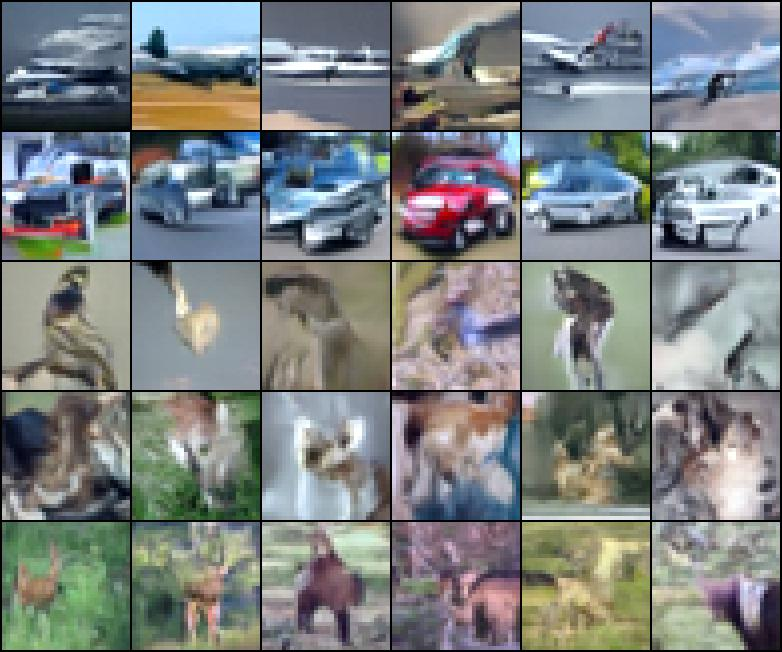
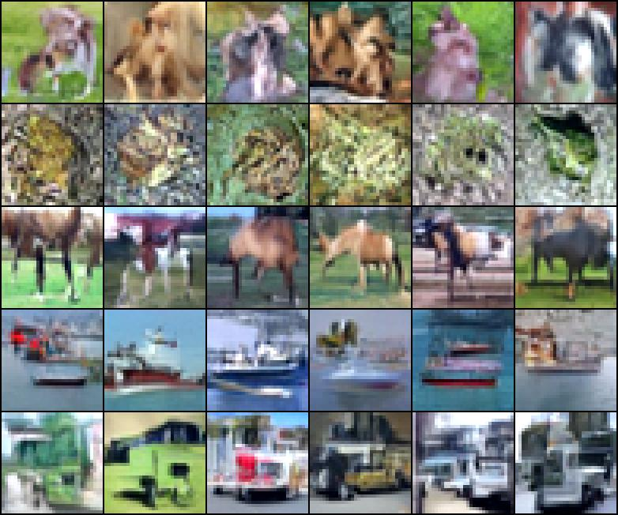
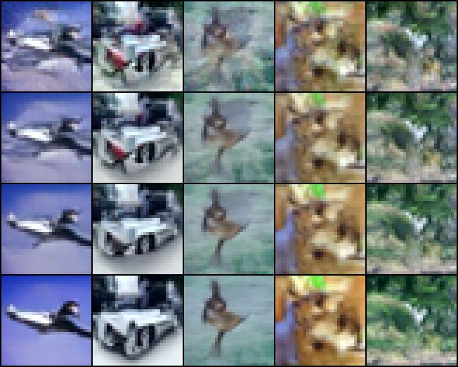

# Inductive Moment Matching - Training Code

This is an unofficial training code implementation of [Inductive Moment Matching](https://arxiv.org/abs/2503.07565). 

## Disclaimer

The intention of this repository is purely educational and should help anyone who wants to experiment with the method. Note again that this is is an unofficial implementation based on my own understanding of the article so far. I created this repository as the [official implementation](https://github.com/lumalabs/imm) does not include any training code or an MMD loss implementation up to now. As soon as it does, consider using and referencing the official repository. DO NOT expect this implementaion to reproduce the results of the article, and ALWAYS look out for bugs or deviations from the article.


## Dependencies

The code is mostly compatible with the original dependencies, just added [lucidrains pytorch-ema](https://github.com/lucidrains/ema-pytorch):
```sh
conda env create -f env.yml
```

## IMM Training on CIFAR10

The repository acts as a minimum working example to train a denoising diffusion model using [Inductive Moment Matching](https://arxiv.org/abs/2503.07565). In essence, it only adds two python files to the official code, most importantly ```training/preconds_training.py```. There you can find necessary additions to the ```IMMPrecond``` class for the calculation of the Maximum Mean Discrepancy loss. 
Note that I focused on the flow matching schedule and, for now, ignored the EDM part.

The file ```train.py``` represents a minimalistic training code using the CIFAR10 dataset and a DiT_S_4 model. Below are some generated images after running the training script with the default parameters. I've used a classifier free guidance of ``2.5`` and **!only 4 steps!**:

<p align="center">
  
  
</p>

You have to pinch your eyes a bit to see an airplane, car, bird, cat, deer, dog, frog, horse, ship and truck (top -> down, left -> right). The employed DiT_S_4 is differs from the article and is certainly not the best choice for pixel-space diffusion, feel free to experiment with different architectures. For this example code, I did not focus on optimizing training/network parameters to increase the quality of generated images. Below is a comparison of images generated from the same noise with 1, 2, 4 and 8 steps:

<p align="center">
  
</p>

Generally speaking, it is great that the method is quite stable with small batch sizes, given that the authors trained their models exclusively with a whopping batch size of ``4096``. There is one point where I had to fill a gap, which is the weighting function in the kernel $\tilde w(s,t)$. The authors state that this equals $c_\mathrm{out}(s,t)$ defined in Appendix C5. I understood this to be $\tilde w(s,t) = -(t-s) \times \sigma_d$ for flow matching. However, a negative weight does not make sense as the kernel function would be small for close points and explode for large distances. For now, I assumed  $\tilde w(s,t) = t-s$. Another gap is the parametrization of the $f^{\theta -}(x)$ model. Previous consistency models mostly use an EMA model, yet I found training is stable (maybe even faster) just using a no_grad environment for CIFAR10.

## Checklist

- [ ] Kernel weighting $\tilde w(s,t)$, is it correctly implemented?
- [ ] Should one use an EMA model or the current model in a no_grad environment for the $f^{\theta -}(x)$ evaluation?
- [ ] Add options to change $k$, $a$ and $b$ hyperparameters 
- [ ] Add different $r(s,t)$ mappings
- [ ] EDM schedule


## Citation

```
@article{zhou2025inductive,
  title={Inductive Moment Matching},
  author={Zhou, Linqi and Ermon, Stefano and Song, Jiaming},
  journal={arXiv preprint arXiv:2503.07565},
  year={2025}
}
```
